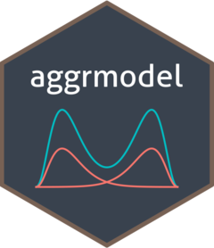

<!-- README.md is generated from README.Rmd. Please edit that file -->

# aggrmodel 

<!-- badges: start -->

<!-- badges: end -->

A R package to fit aggregated data model.

## Installation

You can install the development version from
[GitHub](https://github.com/) with:

``` r
# install.packages("devtools")
devtools::install_github("gabrielfranco89/aggrmodel")
```

## Example

This is a basic example which shows you how to solve a common problem:

``` r
library(aggrmodel)

df = simuData
mkt = attr(df, "market")
df = subset(df, cluster==1)
mkt = subset(mkt, group %in% unique(df$group))

aggrFit = aggrmodel(data = df,        ## Your data
                    market = mkt,     ## Data market
                    Y = y,         ## Dep. variable
                    timeVar =time,   ## Time variable
                    groupVar = group, ## Group variable
                    repVar = rep,     ## Replicate variable
                    n_basis = 7)      ## Number of basis functions
```
